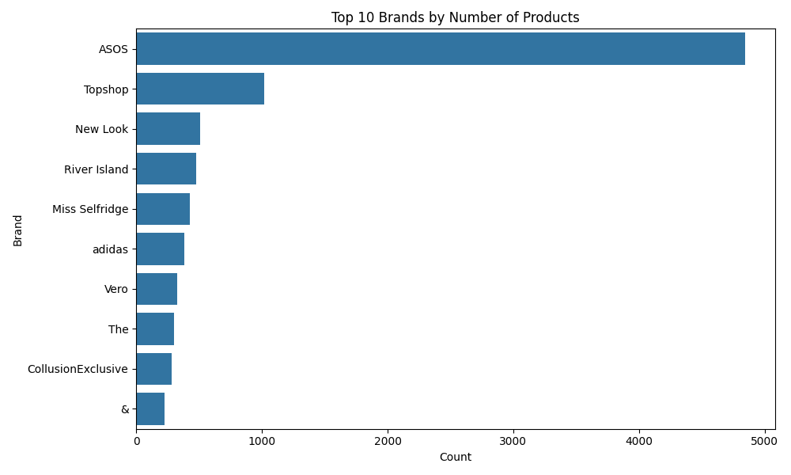
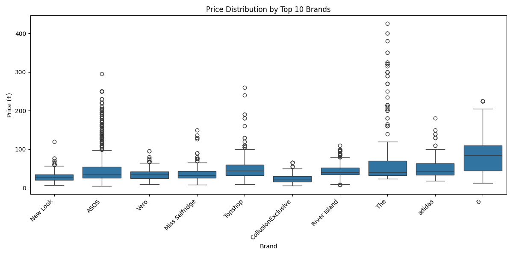
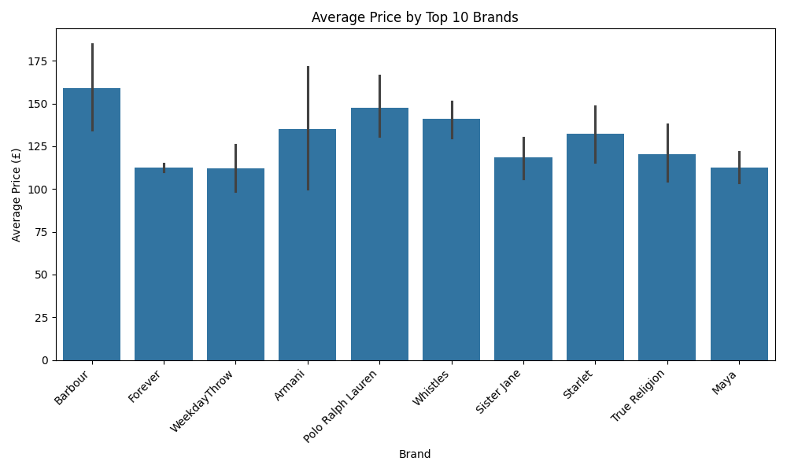

# ASOS Product & Pricing Analysis

## Project Overview

This project analyzes ecommerce product data from ASOS using Python.

The main goal was to clean raw product data, explore pricing patterns, and analyze product distribution across different fashion brands.

---

## Tasks Performed

- Cleaned and processed raw ecommerce data
- Converted price values into numeric format
- Handled missing and invalid data
- Extracted brand names from product descriptions
- Standardized inconsistent brand labels
- Analyzed product pricing across brands
- Created visualizations using Matplotlib and Seaborn

---

## Visualizations

| Chart | Description |
|---|---|
|  | Top brands by number of products |
|  | Price distribution across brands |
|  | Average product price by brand |

---

## Key Insights

- Some brands had significantly more products than others
- Premium brands showed higher average prices
- Product prices varied across different fashion brands
- Raw ecommerce data required multiple cleaning steps before analysis

---

## Tools Used

- Python
- Pandas
- Matplotlib
- Seaborn

---

## Project Structure

asos-pricing-analysis/
│
├── images/
├── products_asos.csv
├── asos_analysis.py
└── README.md
